# Angular 101

Conceptos fundamentales de Angular 8. Bases sobre la arquitectura de este Framework para programar aplicaciones web con sus mejores prácticas. Conexion de aplicaciones con una API para obtener datos de un sistema de Backend. Distribución con Firebase

# ¿Que es ?

<https://ngchallenges.gitbook.io/project/angular>

Es un Framework o plataforma que te permite crear aplicaciones Web o SPA (Single Page Applications). Creado por Google.

# Angular CLI - Otros Comandos.

<https://cli.angular.io/>

<https://angular.io/cli/generate>

```
npm install -g @angular/cli

```

- versiones

```
ng version
```

- Dar de alta un proyecto

```
ng new project
```

- Corer test

```
ng test
```

- Proyecto modo desarrollo

```
ng serve --port 4200 --open
```

- compilar para produccion

```
ng build --prod
```

- Limpieza cache

```
npm cache clean -f
npm cache verify
```

- Que versiones tiene el proyecto

```
ng --version
```

- Generacion de componentes

```
ng generate component nombreComponente --module app.module
ng generate component nombre-del-component
ng g c nombre-del-component
```

- Generacion de interfaz

```
ng g i interfaz
```

- Generando PIPE

```
ng generate pipe new_pipe
```

- Generar directiva

```
ng generate directive <name>
ng g directive <name>
```

- Generar servicio

```
ng generate service <name>
ng g s <name>
```

- Generar modulo

```
ng generate module <name>
ng g m <name>
```

- Generar guardian

```
ng generate guard <name>
ng g g <name>
```

# Estructura

<https://angular.io/guide/file-structure>

├── .editorconfig # Configuración para editores de código

├── .gitignore # Lista de archivos no rastreados por git

├── angular.json # Archivo de configuraciones de construcción, compilacion y testing.

├── browserslist # Configuración compartidas para los navegadores

├── e2e/ # Carpeta para los test end to end

├── karma.conf.js # Configuraciones de Karma (Unit test)

├── node_modules/ # Carpeta de las librerías y paquetes instalados por npm

├── package-lock.json # Provee información sobre las versiones de las paquetes de npm

├── package.json # Configuración de las
paquetes de npm

├── README.md # Introducción a la documentación de la app

├── src/ # Carpeta de la aplicación raíz (assets, componentes etc..)

├── tsconfig.app.json # Configuraciones de Typescript especificas de la app

├── tsconfig.json # Configuraciones de Typescript

├── tsconfig.spec.json # Configuraciones de Typescript para los test

└── tslint.json # Configuraciones TsLint

# Data binding en Angular

<https://angular.io/guide/binding-syntax>

FUENTE: <https://gustavodohara.com/blogangular/banana-in-box-banana-la-caja/>

¿Qué es «Banana In a Box»?, es una terminología de Angular que se refiere a ésta notación [()] que básicamente hace referencia a el famoso two-ways biding, o sea, al mecanismo de actualizar la vista y el modelo al mismo tiempo.

Angular está pensado para actualizar datos en la pantalla dinámicamente, me refiero a que en la pantalla en la que estamos, los datos van cambiando automáticamente sin referescar el browser.

Pero ésto no se hace mágicamente, los datos viajan del controlador a la vista (la pantalla que estás viendo) y también se puede dar el caso los datos viajan de vista al controlador. Y por último, se puede dar el caso de que ambas acciones puedan pasar al mismo tiempo. Estos tres casos se pueden ver gráficamente de la siguiente forma y **para cada uno de esos casos, Angular tiene diferentes mecanismos para actualizar la pantalla**

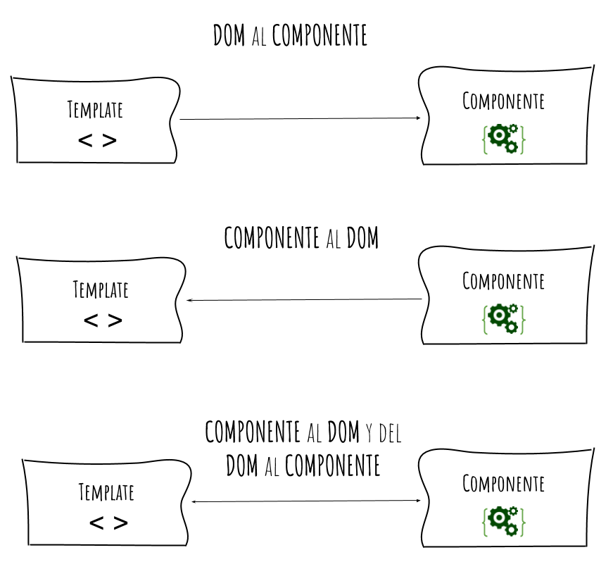

## FROM Componente TO DOM - interpolation

_Forma de mostrar variables en tu template_

Los templates de Angular utilizan html como lenguaje de maquetación donde se puede ejecutar **interpolación de strings** mediante una implementación de moustache donde dentro de los corchetes puedes hacer una sentencia que se resolverá como un string para ser renderizado en el DOM.

Nuestros templates tienen acceso a las variables exportadas en el archivo .ts con el mismo nombre (componente).

En el ejemplo vemos que hay una variable llamada «título» que tiene el valor «hola mundo», y ésta variable se quiere mostrar en la pantalla. Lo que Angular hace cuando encuentra los doble brackets ({{}}) es procesar el contenido de esa variable y devolverlo en forma de string.

Valido en los siguientes contextos

- {{ 1 + 1}}: la cual devuelve 2

- {{ miVariable }}: donde miVariable es una variable definida en el Component (como vimos en el ejemplo anterior)

- {{ miMetodo() }} : donde miMetodo() es un método definido en el Component

¡Ojo!

No sólo hace eso una vez, sino que, si en el medio cambiamos el valor de esa variable «título», el valor se va a actualizar en la pantalla sin que nosotros hagamos nada.


## FROM Component TO DOM ++

Al igual que la Interpolación, Property Binding se usa para pasar datos del Controler al DOM, y _los datos van en una única dirección_


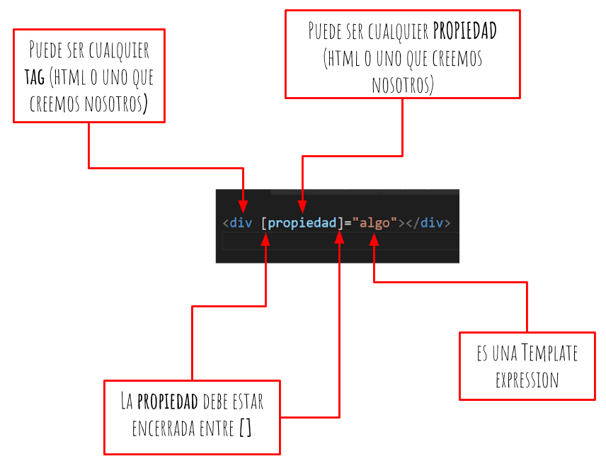

Fijaté que la propiedad a modificar se encierra entre «[]», si no lo encerrás de esa forma esa propiedad no se va a modificar y sera como un simple string.

Esta forma puede aplicarse tanto a un elemento, como a un componente, como a una directiva, o sea, se le pueden pasar datos a cualquiera de esos tres:

- elemento: 

- componente: <vehicle-detail [vehicle]=”currenVehicle”></vehicle-detail>

- directiva: <div [ngClass] = “{selected: isSelected}”> X-Wig</div>

¡Ojo!

- No podés actualizar valores del elemento a la variable, solo podés setear propiedades de «afuera» para «adentro»
- No podés llamar a una función (para eso se usa event binding)
- No podés quedarte «escuchando» que una propiedad actualice tu variable o lo que le pases , no podés quedarte escuchando a que «algo» actualice miVariable y te avise. Sólo podés setearle el valor a la propiedad «src» (para eso se usa Banana in a Box)

# FROM DOM TO Componente.

Ésta es la forma de enviar «algo» del elemento al componente. Cualquier acción que haga el usuario (click, mouseover etc..) es una acción que se puede capturar. Cualquiera de esas acciones puede disparar una acción desde el elemento DOM hacia el Controlador. La forma de capturar cualquiera de esas acciones es quedarse escuchando un evento en particular y en el momento en que ocurran, ejecutar una acción.


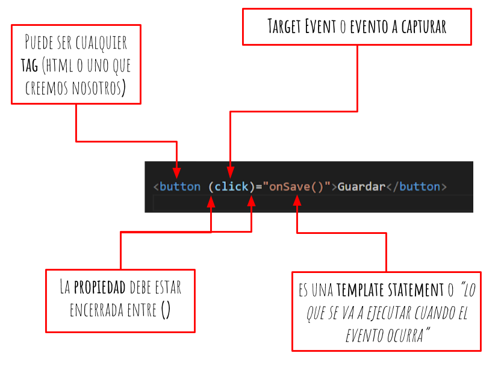

- $event
  Cuando se declara un Event Binding, Angular le asigna al Evento a capturar un handler (o un manejador). Este manejador tiene como objetivo ejecutar la «template statement» cuando el evento ocurra. Además, lo que hace el handler es recibir un objeto llamado $event (este objeto es creado por Angular) y lo deja disponible para la Template statement por si necesita algún dato del evento.

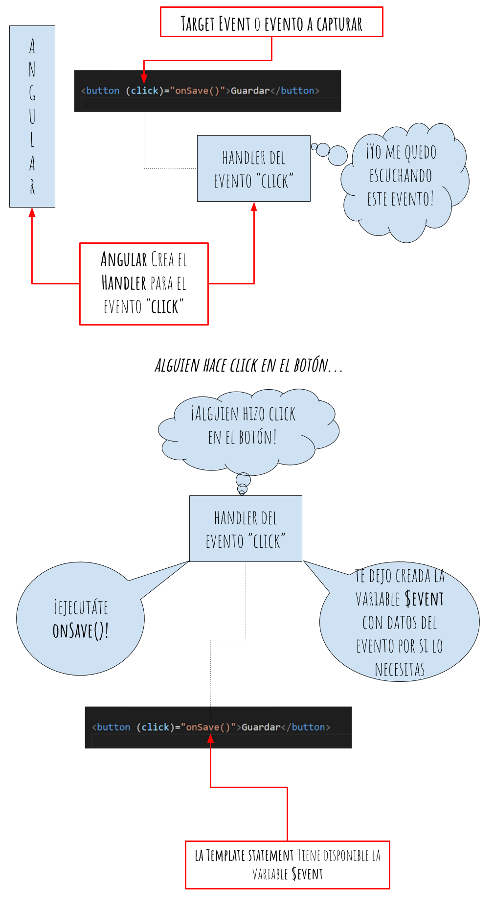

Por ejemplo, en el Tag HTML «input» que captura datos del teclado del usuario, si uno quisiera capturar qué tecleó el usuario, se podría acceder de la siguiente forma: $event.target.value. El $event cambiará dependiendo del evento que se capture.

## Banana Box

Es la forma de two-way bidning o su forma común «banana in a box«, es la combinación de Property binding con Event binding, o sea, mezclamos [] con () y tenemos [()].

¿Para qué se usa el two-way bindings?, para enviar datos del DOM al Componente y del Componente al DOM, por eso se llama two-way binding


Si el usuario teclea algo, el Controlador será notificado y podrá efectuar una acción con eso. Y por otro lado, si el Controlador modifica la variable nombre (por ejemplo borrando los datos) el DOM se actualizará automáticamente. ¡Y nosotros no vamos a hacer nada!

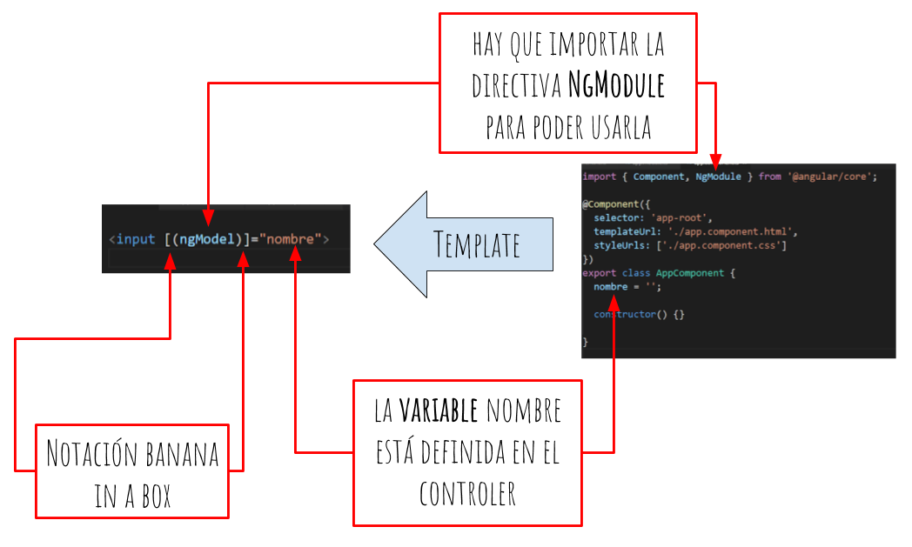

Ojo!

para que funcione la directiva NgModule hay que importar el módulo FormsModule.

Conclusiones: Restringir el acceso del DOM al Controlador y viceversa, hace nuestro código mucho más legible, más controlado y menos propenso a errores.

**_Cuando decidas si usar () ó [], o ambos, antes tomáte dos segundos para pensar que querés hacer: pasar datos del DOM al Controlador, del Controlador al DOM o ambos. Si tenés eso en mente, ¡tu código será mucho mejor!_**

# Directivas

<https://angular.io/api/common#directives>
<https://vanessamarely.medium.com/directivas-en-angular-efb8a8cf78e0>

Las Directivas extienden la funcionalidad del HTML usando para ello una nueva sintaxis. Con ella podemos usar lógica que será ejecutada en el DOM (Document Object Model).

Cada Directiva que usamos tiene un nombre, y determina donde puede ser usada, sea en un elemento, atributo, componente o clase.

Se dividen en tres tipos diferentes:

- **Directivas de Atributo:** (Alteran la apariencia o comportamiento de un elemento del DOM y son usados como atributos de los elementos.)
- **Directivas de estructurales:** (Alteran la estructura del DOM, agregando, eliminando y manipulando los elementos host a los que están unidos.
  )
- **Componentes:** (Las Directivas de Componente son directivas con un Template.)

# Uso de ngIf

<https://angular.io/api/common/NgIf>
Directiva de angular para realizar condicionales dentro de un template.

```javascript
<div *ngIf="name === 'Christian' && lastname === 'Sanchez'">
      <p>Mi nombre es: {{name}} {{lastname}} </p>
</div>

```

```javascript
<div *ngIf="condition">Content to render when condition is true.</div>

<div *ngIf="condition; else elseBlock">Content to render when condition is true.</div>
<ng-template #elseBlock>Content to render when condition is false.</ng-template>
```

```

<ng-template [ngIf]="isLoggedIn" [ngIfElse]="loggedOut">
    <div>
      Welcome back, friend.
    </div>
</ng-template>

<ng-template #loggedOut>
    <div>
      Please friend, login.
    </div>
</ng-template>

```

# Uso de ngFor add y delete

Para iterar amigo/a!

```javascript
array = ['🍎', '🍏', '🍇', '🍌', '🍑'];
  addItem() {
    this.array.push(this.title)
  }
  deleteItem(index:number) {
    this.array.splice(index,1)
  }
```

```javascript

<button (click)="addItem()">Add item</button>
<ul>
  <li *ngIf="array.length===0">La lista está vacía</li>
  <li *ngFor="let item of array;index as i">
    {{item}} ({{i}})
    <button (click)="deleteItem(i)">Delete</button>
  </li>
</ul>
```

# Uso de ngSwitch

<https://stackblitz.com/>

```javascript
<div [ngSwitch]="product.price">
    <p *ngSwitchCase="200.0">$20.00 de descuento en tu siguiente compra</p>
    <p *ngSwitchCase="500.0">Envío gratuito a toda la República Mexicana</p>
    <p *ngSwitchCase="80000.0">
      Envío gratuito a toda la República Mexicana + 5% de descuento extra
    </p>
    <p *ngSwitchDefault>Comprame!</p>
  </div>
```

# ¿Qué son los componentes y decoradores?

Los componentes son el bloque de construcción de UI más básico de una aplicación Angular. Una aplicación Angular contiene un árbol de componentes .

Gracias al parámetro @ podemos reconocer fácilmente que estamos hablando de un
decorador.
Generalmente usamos los decoradores para extender servicios de terceros, de esta manera evitamos modificar el código original del módulo y en tiempo de ejecución agregamos el funcionamiento que necesitamos.

Abierto para extension cerrado para modificacion.

# Uso de Inputs y Outputs

- Input

Para comunicar de un componente padre a un componente hijo usamos Input y para Para pasar argumentos, desde el template padre podemos utilizar los corchetes cuadrados con el Input para pasar el argumento

- Output

Para comunicar de un componente hijo a un componente padre usamos Output.

Los Output son eventos que podemos cachar desde nuestro componente hijo por parte del padre.
Para declararlos en nuestro componente tenemos que usar el decorador @Output sobre un EventEmitter
Los EventEmmiter's pueden emitir un evento con un argumento que será recibido por el padre.

- Observables
  Por otro lado para comunicar dos componentes hermanos o componentes que no estan relacionados podemos usar observables

# Ciclo de vida de los componentes


- constructor:

Utilizado para crear nuestro componente y ponerlo en interfaz

- ngOnChanges

Detecta el cambio cada vez que tenemos un input. Cada vez que cambiamos la data podamos detectar esos cambios y ver el estado anterior y el estado nuevo.

- ngOnInit

Se ejecuta una vez y es cuando el componente ya está listo en interfaz gráfica, aquí es buena idea hacer llamadas a componentes como a una REST API.

- ngDoCheck

Detecta cuando los elementos hijos de ese componente también son creados y puestos en interfaz, contiene sub-métodos.

- ngAfterContentInit: Se ejecuta cuando Angular realiza cualquier muestra de contenido dentro de las vistas de componentes y justo después de ngDoCheck. Actuando una vez que todas las vinculaciones del componente deban
  verificarse por primera vez. Está vinculado con las inicializaciones del componente hijo.
- ngAfterContentChecked: Se ejecuta cada vez que el contenido del componente ha sido verificado
  por el mecanismo de detección de cambios de Angular; se llama después
  del método ngAfterContentInit. Este también se invoca en cada ejecución posterior de ngDoCheck y está relacionado principalmente con las inicializaciones del componente hijo.
- ngAfterViewInit: Se ejecuta cuando la vista del componente se ha inicializado por completo. Este método se inicializa después de que Angular ha inicializado la
  vista del componente y las vistas secundarias. Se llama después de ngAfterContentChecked. Solo se aplica a los componentes.

- ngAfterViewChecked: Se ejecuta después del método ngAfterViewInit y cada vez que la vista del componente verifique cambios. También se
  ejecuta cuando se ha modificado cualquier enlace de las directivas
  secundarias. Por lo tanto, es muy útil cuando el componente espera algún valor que proviene de sus componentes secundarios.

- ngOnDestroy

Detecta cuando el elemento es quitado desde la interfaz. Util para limpiar procesos de memoria.

# Uso de ng generate y ng lint

- <https://angular.io/cli/generate#ng-generate>

- ng lint
  Es una herramienta que ayuda a mejorar la escritura de código con buenas prácticas.

# Usando los pipes de Angular

<https://angular.io/guide/pipes>

Los pipes en Angular son transformaciones que se le puede hacer a un dato dentro de una template-expression sirve para formatear data como se desee. Los pipes pueden ser anidados, por lo que puede ser bastante poderoso.

```javascript
// La sintaxis es {{ variableName | pipeName:argumentos }}

{{ birthday | date:"MM/dd/yy" }}

{{ birthday | date | uppercase}}

```

- [AsyncPipe](https://angular.io/api/common/AsyncPipe)
- [CurrencyPipe](https://angular.io/api/common/CurrencyPipe)
- [DatePipe](https://angular.io/api/common/DatePipe)
- [DecimalPipe](https://angular.io/api/common/DecimalPipe)
- [I18nPluralPipe](https://angular.io/api/common/I18nPluralPipe)
- [I18nSelectPipe](https://angular.io/api/common/I18nSelectPipe)
- [JsonPipe](https://angular.io/api/common/JsonPipe)
- [KeyValuePipe](https://angular.io/api/common/KeyValuePipe)
- [LowerCasePipe](https://angular.io/api/common/LowerCasePipe)
- [PercentPipe](https://angular.io/api/common/PercentPipe)
- [SlicePipe](https://angular.io/api/common/SlicePipe)
- [TitleCasePipe](https://angular.io/api/common/TitleCasePipe)
- [UpperCasePipe](https://angular.io/api/common/UpperCasePipe)

# Construyendo un propio pipe

Generar

```
ng generate pipe pipes/exponential/exponential
ng g p pipes/exponential/exponential --module app

```

# Construyendo una directiva propia

Las directivas estan para tranformar los elementos del DOM dinamicamente.

Es muy sencillo manipular directamente elementos del DOM en Angular, solo hay que echar mano de la clase ElementRef Pero ojo! Angular lo etiqueta como una mala práctica. La manipulación directa del DOM crea un acoplamiento indeseado entre la capa de renderizado y la de lógica, Para sortear este obstáculo tienes la clase Renderer2 de Angular.
<http://blog.enriqueoriol.com/2017/08/angular-dom-renderer.html>

# Introducción al NgModule

Buena practica: Modular la aplicación por dominio

Los módulos y rutas sirven para dividir y abstraer mejor la aplicación.

Los componentes que hacen parte de una página en particular se pueden encapsular en un mismo módulo.

Los módulos especiales son core y shared.

- app/core: guarda todos los servicios y componentes que usaremos a lo largo de todos los otros módulos.Ej servicios de authenticacion unico para toda la aplicacion.

- app/shared: podemos almacenar componentes y servicios compartidos.

# Creando rutas en Angular

<https://angular.io/guide/router>

Las rutas nos sirven para mostrar en diferentes seccioens de nuestra pagina algun contenido.
En el archivo app-routing-module.ts se encuentra un objeto Route el cual sirve para incrustar las rutas del proyecto.

La sintaxis dentro del router (app-routing-module.ts):

```

import { componentName } from './url/to/componentName.component';

const routes: Routes = [
  {
    path = ‘routeName’,
    component = componentName
  },
]
```

Donde:

- path = ruta relativa al home (’/’) de nuestra app
- component = componente importado desde componentName.component.ts

La forma de implementar el router en un template.html es con el componente router-outlet, donde el router-outlet se reemplazará por el contenido del componente según la URL en la que estés

```
<!-- app.component.html -->

<router-outlet></router-outlet>
```

## 404

Para definir una página no encontrada podemos utilizar la ruta '\*\*' que simboliza cualquier ruta diferente a las anteriormente definidas, el componente también deberá de ser el objeto del componente importado.

```
{
    path: '**',
    component: NotFoundComponent
  }
```

Nota: El orden de las rutas es importante, si algo matchea una ruta, no se segirá a la siguiente, por lo que el not-found, debería de ser la última ruta, siempre

## Redirecciones

Para las redirecciones tenemos que usar las propiedades redirectTo:'route' y pathMatch:'full'

```
 {
    path: 'from',
    redirectTo: 'to',
    pathMatch: 'full'
  },
```

Donde:

- path: Página actual
- redirectTo: página a la que se redireccionará
- pathMatch: tipo de match, en el caso de ‘full’ será con una relación exacta

## Redirecciones sin recargar routerLink

Para poder movernos entre rutas sin recargar nuestra página (tipo single page application) debemos agregar a nuestras anclas ‘< a >’ la directiva routerLink envés del atributo href para que Angular determine que no haga una recarga de la página.

```html
<div>
  <a routerLink="/home">Home</a>
  <!-- Antes <a href="/home">Home</a> -->
</div>
```

## Ancla activa routerLinkActive

Puedes definir una clase para cuando una ruta matchee completamente al agregar la directiva routerLinkActive, misma que agregará una clase al elemento que contenga un routerLink, de esta manera en los estilos podrás acceder al elemento seleccionado.
.
La recomendación es llamar “active” al routerLinkActive (routerLinkActive="active">), de esta manera podrás acceder desde el css mediante la clase .active

```html
<nav>
  <a routerLink="/home" routerLinkActive="active">Home</a>
  <a routerLink="/products" routerLinkActive="active">Products</a>
  <a routerLink="/contact" routerLinkActive="active">Contact</a>
</nav>
```

```css
nav a {
  padding: 5px;
  text-decoration: none;
  &.active {
    background-color: papayawhip;
  }
}
```

# Simple Templates

Dado que tengamos un html muy corto, en la definicion del componente podemos indicar:

```javascript

@Component({
  selector: 'app-root',
  //templateUrl: './app.component.html',
  template: '<router-outlet></router-outlet>',
  styleUrls: ['./app.component.scss'],
})

```

# Creando el módulo del website con vistas anidadas

Los layouts como los conocemos en otros lenguajes los podemos definir con vistas anidadas.

En el archivo routing se incorpora el componente "layout" en la variable de routes, pero esta vez todos los componentes que se basen en este deberán estar anidadas.

Para anidarlos el objeto del componente creado tendrá que tener una nueva característica ‘children’, el cual tendrá los ‘path’ y ‘component’ de las rutas que se basen en la anterior.

```javascript
const routes: Routes = [
  {
    path: "",
    component: LayoutComponent,
    children: [
      { path: "", redirectTo: "/home", pathMatch: "full" },
      { path: "home", component: HomeComponent },
      { path: "product", component: ProductComponent },
      { path: "products", component: ProductsComponent },
      { path: "products/:id", component: ProductDetailComponent },
      { path: "contact", component: ContactComponent },
    ],
  },

  { path: "**", component: NotFoundComponent },
];
```

# Lazy Loading

<https://angular.io/guide/lazy-loading-ngmodules>

Flujo normal carga de una web

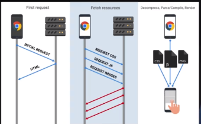

FLujo con Archivos js vemos que lo que mas tarda es la descarga y con estos framework de js toda nuestra logica se encuentra en un solo archivo lo cual lo hace exponencialmente mas "pesado" en el tiempo.

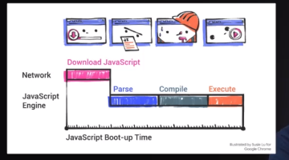

**Lazy load se encarga de fragmentar el archivo generado main.js para que cargue más rápido la aplicación**, basada en la técnica “divide y vencerás”, cargando siempre el código JavaScript necesario para que la vista funcione de manera adecuada.

Con ésto claro, un pre-requisito fundamental es modularizar la aplicación.

Un modulo encapsula varios elementos de una aplicación (components, directivas, servicios, etc). Por lo general se modulariza cada vista de nuestra aplicación. Para crear un modulo se utiliza el comando ‘ng g m nombreModulo’

Es buena practica crear un modulo por vista, y dentro este una carpeta ‘components’ con los componentes que utilizara.

En los módulos existe un archivo ‘nombreModulo.module.ts’ el cual tendrá que importar los componentes que utilizara.

La clave para separar los módulos es:

- Crear una carpeta que contendrá el módulo
- Crear un módulo que llame a todos los componentes que utilizará
- Crear un módulo para sus rutas
- Cambiar la importación dentro del routing principal
- Eliminar referencias o errores que surjan por el movimiento

## metadata de los modulos:

- **Declares** which components, directives, and pipes belong to the module.
- Makes some of those components, directives, and pipes **public** so that other module's component templates can use them.
- **Imports** other modules with the components, directives, and pipes that components in the current module need.
- **Provides** services that other application components can use.

Cuando ya esta modularizado, hay que definir una ruta inicial en el archivo routing del modulo

```javascript
import { HomeComponent } from "./components/home/home.component";

const routes: Routes = [
  {
    path: "",
    component: HomeComponent,
  },
];
```

Luego en el app-routing cargamos la ruta del modulo con loadChildren, de esta forma se carga dinámicamente. De esta forma resolvemos todo un modulo (no un componente únicamente).

```javascript
const routes: Routes = [
  {
    path: "",
    component: LayoutComponent,
    children: [
      {
        path: "",
        redirectTo: "/home",
        pathMatch: "full",
      },
      {
        path: "home",
        loadChildren: () =>
          import("./home/home.module").then((m) => m.HomeModule),
      },
    ],
  },
  {
    path: "**",
    component: PageNotFoundComponent,
  },
];
```

De esta manera el "peso" de este modulo solo se llamara cuando se carga la pagina que lo utiliza

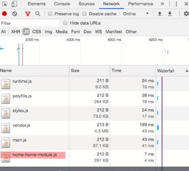

Ahora tenemos que hacer que la aplicación realice una precarga de los otros módulos de las otras vistas cuando la vista que estamos consultando ya termine. Para realizarlo en el archivo ‘app-routing’ debemos cambiar de estrategia de carga, precargando los archivos con ‘PreloadAllModules’. No olvidar importar ‘PreloadAllModules’

```javacript
import { Routes, RouterModule, PreloadAllModules } from '@angular/router';

  @NgModule({
    imports: [RouterModule.forRoot(routes, {
      preloadingStrategy: PreloadAllModules
    })],
    exports: [RouterModule]
  })

```

# Creando un shared module y core module

- **shared module**: Agrupa Modulos o componentes que son utilizados en varios lugares (header,footer, componentes, directivas, artefactos graficos)

  - Es una buena práctica en el “share module” guardar componentes, directivas y pipes o como tal todas las cuestiones de artefactos graficos.

- **core module** : agrupa modulos o componentes si y solo si SON UTILIZADOS a lo largo de toda la aplicacion pero solo generando un referencia unica.
  - DATO: Es una buena práctica en el “core module” guardar solo servicios que tengan una sola
    referencia de los datos.
  - DATOS_2: El modulo Core sigue el patrón Singleton.
    Variable global, una única instancia.

El core module si o si estara en toda la aplicacion generando solo una referencia unica, mientras que shared module tiene que ser importado.

# Error Port 4200 Is Already In **Use**

```
sudo kill $(sudo lsof -t -i:4200) Or
sudo kill `sudo lsof -t -i:4200` Or
sudo lsof -t -i tcp:4200 | xargs kill -9
```

# Guardianes

<https://angular.io/api/router/CanActivate>

Quien puede entrar o no a una ruta. Hay diferentes tipos de guardianes.

- CanActivate : Mira si el usuario puede acceder a una página determinada. (muestro o no una ruta)
- CanActivateChild :
- CanLoad :
- CanDeactivate:

```
      {
        path: 'contact',
        canActivate: [AdminGuard],
        component: ContactComponent,
      },
```

# Instalando Angular Material

<https://material.angular.io/guide/getting-started>

```
ng add @angular/material

npm install --save angular-hammer

```

# Bulma

Bulma is a free, open source CSS framework based on Flexbox and used by more than 200,000 developers.

<https://bulma.io/documentation/>

-Add bulma to the project

```
npm install bulma
```

- Update the angular.json for bulma css by

```json
 "styles": [
      "src/styles.scss",
      "node_modules/bulma/css/bulma.css"
 ],
```

# Creando vistas con Angular schematic

<https://material.angular.io/guide/schematics>

Schematics es una forma de crear archivos o reglas desde el CLI (command line interfaces), material ya tiene incluídos algunos schematics muy útiles para poder crear componentes de uso regular logrando interfaces muy potentes.

Para poder crear un schematic tienes que tener instalado 'angular/cdk', mismo que viene por defecto al instalar Angular desde el CLI, pero que se tiene que instalar si no llegasen a funcionar los comandos.

Los schematics generan código, así que busca en la documentación que quieres crear y pégalo en la línea de comandos, por ejemplo:

```

ng generate @angular/material:dashboard admin/components/dashboard

ng generate @angular/material:table admin/components/list-products

ng generate @angular/material:navigation admin/components/nav

ng generate @angular/material:address-form admin/components/product-form
```

# Creando nuestros propios servicios: HTTP Client

<https://angular.io/guide/http>

La mayoría de las aplicaciones front-end se comunican con los servicios de back-end a través del protocolo HTTP.

Los navegadores modernos admiten dos API diferentes para realizar solicitudes HTTP: la interfaz XMLHttpRequest y la API fetch(), pero Angular implementa su propia interfaz basada en XMLHttpRequest para facilitar el fetching de datos, api expuesta por los navegadores.

HttpClient viene desde @angular/common/http y ofrece una interfaz API HTTP de cliente simplificada para aplicaciones Angular.

Los beneficios adicionales de HttpClient incluyen:

- Suite de pruebas simplificadas
- Requests y responses tipados
- Intercepción de requests y responses
- Observables
- Manejo de errores optimizado (mediante streams)

# Ambientes en Angular (env)

Un entorno de aplicación en Angular donde podemos establecer diferentes configuraciones segun el entorno staging, prod, dev.

La recomendación es hacer ambientes dentro del directorio environments/environment.[nombre].ts, y para registrarlo necesitas modificar el archivo angular.json
.

Para agregar un nuevo ambiente al angular.json se necesitan duplicar el environment de build y de serve dentro de projects.<project-name>.architect.build.configurations.nameOfNewEnvironment y de projects.<project-name>.architect.serve.configurations.production y cambiar production por el nombre que quieras que reciba tu environment, como staging o local, etc.
.

Recuerda que es muy delicado este archivo y que lo tienes que hacer a conciencia, además de que tienes que colocar la ruta de tu archivo de environments en fileReplacements, porque lo que hace este archivo es reemplazar las ocurrencias de importación de src/environments/environment.ts por el archivo de ambiente que le indiques.

```javascript
{
  projects: {
    nameOfProject: {
      ...
      architect: {
        build: {
          ...
          production: {} <-- Duplicar este objeto
        },
        serve: {
          configurations: {
            ...
            production: {} <-- Duplicar este objeto
          }
        }
      }
    }
  }
}
```

Para correr

```
ng serve -c=stag
ng build -c=stag
```

# Introducción al FormControl

Formularios rectivos
<https://angular.io/guide/reactive-forms>

# Programación reactiva

Angular utiliza una libreria para gestionar todo lo que es asincronia llamada rxjs no es exclusiva de angular.

Esto utiliza basicamente un patron de software Observer donde su tarea es como una estacion de radio crear canales de escucha en resumen interactuan canales de escucha y oyentes behaviorSubject es un tipo de canal donde el que se suscribe escucha el ultimo valor que se les mando a los demas es como si contestaras un telefono y escucharas la ultima palabra que se dijo haci la llamada fuera ayer
cada canal de escucha rxjs lo llama Observable
lo que el profe hizo fue primero creo el tipo del canal que es behaviorSubject y luego asObservable abrio la emisora y esa emisora puede tener muchos oyentes cada oyente abri su canal.

De esta manera si hay un cambio el la emisora lo escuchan todos sus oyentes entonces si se agrega algo al carrito de compra se va a ver en todos los componentes que se suscriban sin necesidad de actualizar.

# RXJS Operators

<https://rxjs-dev.firebaseapp.com/guide/operators>

```html
<span [matBadge]="total$ | async" matBadgeOverlap="false" matBadgeColor="warn"
  >Cart</span
>
```

Suscripcion y desuscripcion automatica.

```javascript
public total$: Observable<number>;
this.total$ = this.cartService.cart$.pipe(
      map((products) => products.length)
    );
```

# Instalar Angular Firebase y configurar Firebase Auth

<https://www.npmjs.com/package/@angular/fire>

```
ng add @angular/fire
```

# Implementando Auth y Guards

<https://github.com/angular/angularfire/blob/master/docs/auth/router-guards.md>

<https://cheatography.com/tag/angular/>

# Angular 102

# Migracion

<https://update.angular.io/>

1- actualizar cliente de comandos global (angular cli)

```
sudo npm i -g @angular/cli@latest

```

2- validar version (en un contexto externo al proyecto)

```
ng version
```

3- actualizar en el proyecto y esto nos indicara que hacer

```
ng update
```

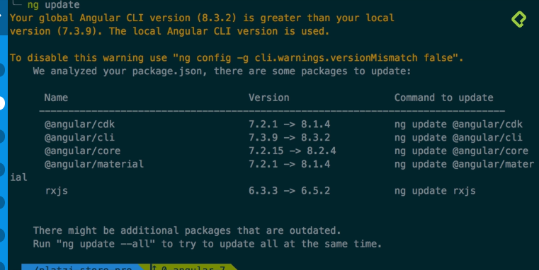

# ¿Qué es Ivy?

<https://angular.io/guide/ivy>
<https://profile.es/blog/angular9/#:~:text=Ivy%20es%20el%20nombre%20que,%C3%BAltima%20versi%C3%B3n%209%20del%20framework.>

Ivy es el nombre que el equipo de Google le ha dado a su nuevo motor de renderizado,

Elimina no solo dependencia si no cualquier fragmento de código que no se use. Por ejemplo un método que creaste y nunca usas

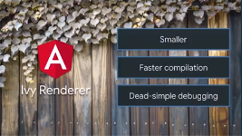

# Differential loading

Differential Loading es un proceso mediante el cual el navegador elige entre Javascript moderno o heredado en función de sus propias capacidades, es decir se crean dos paquetes a compilar uno para los navegadores modernos que permiten ES2015 > y un paquete para navegadores legacy o antiguos que solo admiten la versión de ES5 de Javascript.

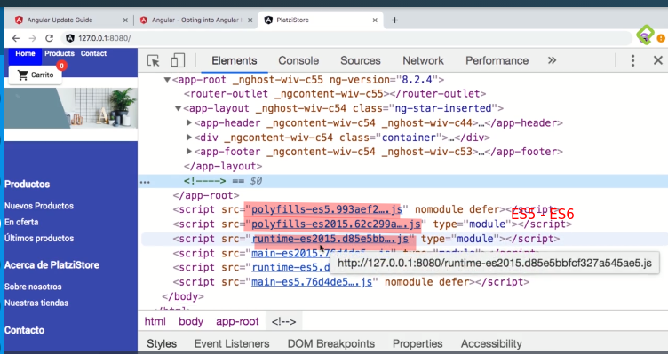

El navegador cargará automáticamente el paquete que le corresponda, gracias al soporte de los módulos de ES6 en los navegadores más nuevos, por lo que tendrán que _cargar menos código y cargar una cantidad mucho menor de polyfills_.

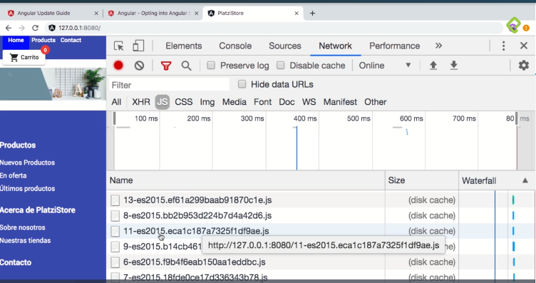

Resultado:

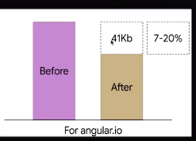

# Dynamic import

Es la forma nativa de precargar modulos de JS. De esta manera angular trabaja menos :P

Siempre es mejor indicar el string del path asi se puede realizar analasis estatico del codigo como webpack pueda hacer analisis y optimizacioens sobre el paquete importado.

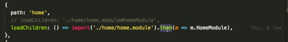

# CLI Builders

<https://angular.io/guide/cli-builder>
Aquellos que nos habilitan a extender las funcionalidades del cliente de comandos de angular, sobre todo correr tareas custom nuestras.

Existen 3 categorias de comandos

- Tareas de creación y modificación de código.

  - ng new
  - ng generate
  - ng add
  - ng update.

- Tareas simples.
  - ng help,
  - ng version,
  - ng doc
- Tareas complejas. ( API arquitect ABIERTAS A CUSTOMIZAR!)

  - ng serve,
  - ng build,
  - ng test,
  - ng lint.

los comandos de tareas complejas se abren para extender y hacerlo a nuestro manera.

Ej. @angular/fire, @zeit/ng-deploy y @azure/ng-deploy donde en uan linea de codigo hacemos deploy a azure, firebase o zeit

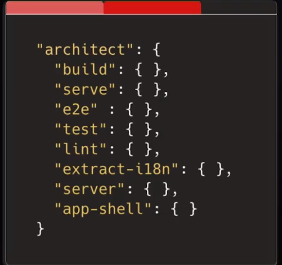

Podemos ejecutar estas tareas a nuestra manera, agregar cosas etc.

# Patrón LIFT (Locate, Identify, Flat and Try DRY) y Naming

<https://angular.io/guide/styleguide#t-dry-try-to-be-dry>

El patrón LIFT hace incapie en la escalabilidad desde las buenas prácticas que Angular propone para mantener un proyecto organizado y estandarizado a nivel de organizacion de codigo.

Este patron (LIFT) define 4 reglas basica para organizar un proyecto angular.

- **Locate:** Expresa que debe haber una facilidad de encontrar los componentes, directivas, pipes, servicios, etc en la estructura del proyecto. Locate propone dividir nuestro proyecto por caracteristicas (footer, header, home).

- **Identify:** Se trata de reconocer rápidamente el rol que cumple cada uno de los archivos, es decir, colocarle ‘ apellido’ al archivo.

  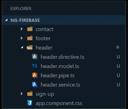

- **Flat:** Mantener la estructura de nuestro proyecto de forma plana, con máximo 3 niveles de profundidad en la estructura de carpetas del proyecto.

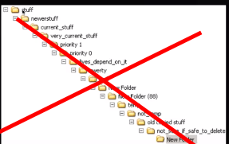

- **Try DRY:** Intentar no repetirse. Alienta la reutilización de código con el fin de tener un proyecto mantenible.
  Si algo se repite tratar de abstraerlo cosa que si cambia solo cambias en 1 solo lugar.

# Aplicando el patrón: Smart and Dumb components

- **Dumb componentes** (interaccion & renderizar)

Un Componente que no hace absolutamente nada por sí mismo y que depende de Componentes Smart.

Todo lo que hacen los Dumb componentes es presentarse al DOM. Por lo tanto, también se les conoce como “Presentational Components” or “Isolated Components”.

```javascript

import{ Component, Input, OnInit } from ‘@angular/core’;
@Component({
selector: ‘app-book-list’,
templateUrl: ‘./book-list.component.html’,
styleUrls: [‘./book-list.component.css’]
})
export class BookListComponent implements OnInit {
@Input(‘book’) book: any[];
constructor() { }
ngOnInit() {
}
}
```

```html
<div class="books-list-container">
  <h3>{{book.volumeInfo.title}}</h3>
  <p>{{book.volumeInfo.authors[0]}}</p>
  <p>{{book.description}}</p>
</div>
```

Acepta un input con los libros y simplemente los muestra.

- **Smart componentes** (fetch y envio de datos )

Los Smart componentes son aquellos componentes que saben cómo manejar los datos, cómo obtener datos de los servicios, cómo interactuar con los servicios y hacer un seguimiento del estado y se preocupan por el funcionamiento de la aplicación en su conjunto.
Se llaman containers porque envían datos a los Dumb Components via property bindings.

```javascript
import { Component, OnInit } from '@angular/core';
import { HttpClient, HttpHeaders} from '@angular/common/http';
import {map} from 'rxjs/operators';
import { Observable } from 'rxjs';
@Component({
selector: 'app-books',
templateUrl: './books.component.html',
styleUrls: ['./books.component.css']
})

export class BooksComponent implements OnInit {
private API_KEY:string = 'API_KEY';
book: Observable<any[]>;
constructor(private _http: HttpClient) { }
ngOnInit() {
const URL = 'https://www.googleapis.com/books/v1';
//Fetch All Books from API
//@Params = URL: String
this.fetchBooks(URL);
}
fetchBooks(URL: string){
this.book = this._http.get<any>(`${URL}/q=&key=${this.API_KEY}`,             {headers}).pipe(
   map(resp=>{
    return resp.items;
   });
 );
}}
```

Usando estos conceptos, hemos separado el código de lógica de negocios y el código de presentación entre los Smart & Dumb components.

# Manejo del estado en la aplicación

Algunas librerias para este fin:

- redux <https://redux.js.org/>
- ngrx <https://ngrx.io/>
- akita <https://github.com/datorama/akita>

# Implementando Short imports con Typescript

Para acortar las importaciones.

tsconfig.json:

```
{
 ...
 "compilerOptions": {
   "baseUrl": "src",
   ...
   "paths": {
     "@core/*": ["app/core/*"],
     "@material/*": ["app/material/*"],
     "@shared/*": ["app/shared/*"]
   }
 },
 ...
}
```

From

```
import { ProductsService } from '../../../../services/products/products.service';
```

To

```
import { ProductsService } from '@core/services/products/products.service';
```

# HTTPClient - Evitando doble subscribe

En el siguiente ejemplo como vemos tenemos un doble suscribe, uno anidado a otro
y sabemos lo que muchas llamadas encadenadas pueden producir CALLBACK HELL!

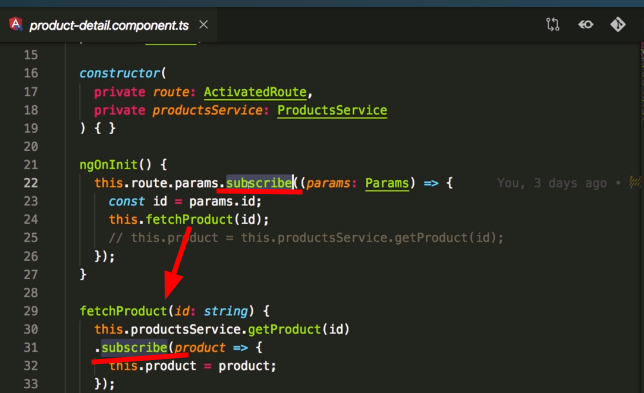

A los fines de mejorar esto podemos utilizar observables. Con los observables podemos manipular flujos de datos.

Con **swichMap** podemos mejorar el comportamiento anterior el mismo se basa en tengo un observable inicial y lo voy a reemplazar por otro despues que el primero reciba un valor manejando el flujo de manera linear (no con doble suscribers)

Para el ejemplo recibo el id por ruta y luego lo mapeo y lo trasformo el otro observable el de la peticion get

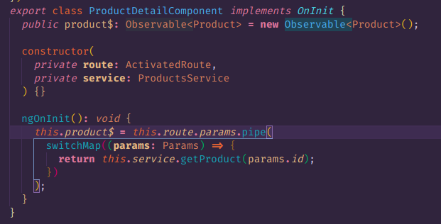

# Tipado en peticiones

Muchas veces las respuestas del backend /API incluyen mucha informacion aparte de las que nos interesa. Para obtener solo los datos que nos interesan podemos utilizar el tipado de peticiones que mediante "casteo" y interfaces nos devuelven solo la informacion necesaria.

```javascript
  getRandomUsers(): Observable<RandomUser[]> {
    return this.http.get('https://randomuser.me/api/?results=2').pipe(
      map((response: any) =>
        response.results.map((user: RandomUser) => {
          return {
            email: user.email,
            gender: user.gender,
            phone: user.phone,
          } as RandomUser;
        })
      )
    );
  }
```

```javascript
  getRandomUser() {
    this.randomUserService.getRandomUsers().subscribe(
      (user) => {
      console.log(user);
    });
    }

```

# Manejo de Errores

A nivel de servicio podemos implementar catchError para capturar loS errores y enviarlos mas puros a la UI

```javascript
  getRandomUsers(): Observable<RandomUser[]> {
    return this.http.get('https://randomuser.me/apiii/?results=2').pipe(
      catchError((error) => {
        return throwError('error');
      }),
      map((response: any) =>
        response.results.map((user: RandomUser) => {
          return {
            email: user.email,
            gender: user.gender,
            phone: user.phone,
          } as RandomUser;
        })
      )
    );
  }
```

Y en el componente

```javascript
  getRandomUser() {
    this.randomUserService.getRandomUsers().subscribe(
      (user) => {
      console.log(user);
    },(error) => {
      console.error(error)
    });
    }

```

Una manera mas generica, indicando una funcion para el manejo de errores

```
  getRandomUsers(): Observable<RandomUser[]> {
    return this.http.get('https://randomuser.me/apiii/?results=2').pipe(
      catchError(this.handleError),
      map((response: any) =>
        response.results.map((user: RandomUser) => {
          return {
            email: user.email,
            gender: user.gender,
            phone: user.phone,
          } as RandomUser;
        })
      )
    );
  }

  private handleError(error: HttpErrorResponse) {
    let message;
    switch (error.status) {
      case 404:
        message = 'Not found';
        break;
      case 401:
        message = 'No Auth';
        break;
    }
    return throwError(message);
  }
```

# Manejo de errores con sentry

<https://sentry.io/welcome/>

Reto: Interceptar errores.

# Uso de retry() para reintentar una petición

Muchas veces queremos dar la posibilidad de reitentar ciertas peticiones si fallan ya que se pueden deber solo a una perdida momentanea de conexion por ejemplo. Para esto contamos con retry

```javascript

  getRandomUsers(): Observable<RandomUser[]> {
    return this.http.get('https://randomuser.me/apiii/?results=2').pipe(
      retry(3),
      catchError(this.handleError),
      map((response: any) =>
        response.results.map((user: RandomUser) => {
          return {
            email: user.email,
            gender: user.gender,
            phone: user.phone,
          } as RandomUser;
        })
      )
    );
  }
```

Nota: debemos tratar de realizar trasformaciones de datos en los componentes dejemoslo para lo servicios.

# Creando un interceptor para Auth

HTTPInterceptors interceptan peticiones HTTP y actualizan la data. El caso mas comun para crear un interceptor es para agregar headers por ejemplo el token de authenticacion a c/u de las request que enviamos.

```javascript

@Injectable()
export class AuthInterceptor implements HttpInterceptor {
  constructor(private tokenService: TokenService) {}
  intercept(
    req: HttpRequest<any>,
    next: HttpHandler
  ): Observable<HttpEvent<any>> {
    const token = this.tokenService.getToken();
    console.log('token', token);
    if (!token) {
      return next.handle(req);
    }

    const req1 = req.clone({
      headers: req.headers.set('Authorization', `Bearer ${token}`),
    });

    return next.handle(req1);
  }
}
```

# Preparación de entorno de pruebas

- **Karma:** <https://karma-runner.github.io/latest/index.html> Correr las pruebas abriendo un navegador y no indica un resultado. (test runner)
- **Jasmine:** <https://jasmine.github.io/ > : framework de testing . Herramientas para poder describir organizar y correr nuestras pruebas
- **Protactor:** <https://www.protractortest.org/#/> Para pruebas de interfaz grafica, pruebas punto a punto.

- **Cypress:** <https://www.cypress.io/> alternativa a protactor para pruebas end to end.

Para omitir pruebas en caso que dea necesario colocamos una x delante de la declaracion de la misma.

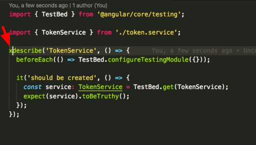

En pruebas se utiliza el patron de las 3 A

- ARRANGE de un método de prueba unitaria inicializa los objetos y establece el valor de los datos que se pasan al método bajo prueba.

- ACT invoca el método bajo prueba con los parámetros organizados.

- ASERT verifica que la acción del método bajo prueba se comporta como se esperaba.

# Reporte con Coverage

Medida porcentual que evalua cuanto codigo ha sido ejecutado , osea en cuanto a nuestro codigo cuantas han sido ejecutadas por nuestras pruebas unitarias.

Muy util para saber cuanto nos falta por probar, que flujos faltan etc. Una buena practica es tener 80% de coverage.

```
ng test --watch=false --codeCoverage=true
```

=============================== Coverage summary ===============================
Statements/Declaraciones : 24.52% ( 64/261 )
Branches : 0% ( 0/28 )
Functions : 1.74% ( 2/115 )
Lines : 15.35% ( 35/228 )
================================================================================

Podemos ver mas detalle en -> coverage/platzi-store/index.html

# Deploy con NGINX y Docker

<https://www.docker.com/>
Nos permite mover nuestra aplicacion en contenedores y distribuitlos en servidores o maquinas locales.

1- Instalar docker <https://www.digitalocean.com/community/tutorials/como-instalar-y-usar-docker-en-ubuntu-18-04-1-es>

2- Descargar imagen nginx

```
sudo docker pull nginx:alpine

```

3- correr contenedor en base a esa imagen desaargada

```
sudo docker run -d -p 8080:80 nginx:alpine
```

4- Validar que el contenedor esta activo en el puerto 8080

5- validar que contenedores estan corriendo actualmente

```
sudo docker ps
```

6- Generamos nuestra aplicacion para produccion

```
ng build --prod
```

7- Le indicamos a docker que tomer los archivos de distribucion /dist y los sirva en el contenedor y para eso vamos a detener el cotenedor.

```
sudo docker ps // obtenemos id
sudo stop <id-del-contenedor-aqui>
```

8- Subimos los archivos al contenedor

```
sudo docker run -d -p 8081:80 -v <tu-path-al-proyecto-en-dist-aqui>:/usr/share/nginx/html:ro -d nginx:alpine

```

9- Para evitar recordar y correr el comando anterior todas las veces generamos un archivo Dockerfile dentro del proyecto que se encargara de esto.

```
FROM node:12 as node

WORKDIR /app
COPY ./ /app
RUN npm install
RUN npm run build -- --prod

FROM nginx:alpine
COPY --from=node /app/dist/platzi-store /usr/share/nginx/html:ro
```

10 - Damos stop a la imagen anteriormente levantada

```
sudo docker ps // obtenemos id
sudo stop <id-del-contenedor-aqui>
```

11- Ejecutamos el archivo Dockerfile dentro del proyecto para construir la imagen

```
sudo docker build . -t platzi-store:latest
```

12- Una vez construida la desplegamos

```
sudo docker run -d -p 8080:80 platzi-store:latest
```

# AOT: Compilación de alto nivel

<https://angular.io/guide/aot-compiler>

En angular existen 2 tipos de compilaciones:

- JIT
- AOT

Como sabemos la gran mayoría del desarrollo se realiza en TypeScript. Este código en TypeScript debe ser compilado a Javascript en algún momento. A esa compilación nos referimos.

Como dice la documentación, Angular ofrece dos maneras de compilar la aplicación:

- **JIT (Justo en el momento)**, que compila la aplicación en el navegador en momento de ejecución. Compilación JIT es la predeterminada cuando corres los comando de solo construcción o de construir y servir:
-

```
ng build
ng serve
```

- **AOT (Antes del momento)**, que compila la aplicación en el momento de construcción (compilación). Para compilar de manera AOT, agrega el sufijo ---aot a los comandos de construcción:

```
ng build --aot
ng serve --aot
```

Nota que cuando corres los comandos con --prod se compila con AOT por defecto.

Todo esto significa que JIT y AOT son solo los momentos en los que vas a compilar el TypeScript a Javascript. Pero también hay ventajas y desventajas.

Cuando compilas JIT en desarrollo te ahorras el tiempo de compilar todo ese TypeScript y lo dejas al momento de ejecución. Pero tenés que llevarte el compilador de Angular que pesa bastantito. Es mejor para hacer compilaciones rápidas en desarrollo.

Cuando compilas en AOT tu tiempo de compilación va a tardar mucho, pero te ahorras el espacio del compilador. Por lo que es mejor para producir el código de producción. Los html ya estan incluidos por lo que no tiene que hacer request nuevamente. Ademas no compila si detecta errores errores en el camino. Otro beneficio es que ofusca el codigo apoyando la seguridad del mismo por lo tanto no deberiamos ir a produccion sin AOT.

# Angular 103

# ¿Qué es un bundle size? Tree shaking y su importancia

El bundle size es el primer concepto que vamos a tener en cuenta a la hora de mejorar la performance de nuestro sitio.

Como ya hemos visto en lo que refiere a JS el proceso que mas tiempo toma es la descarga y esto aumenta cuanto mayor sea nuestro bundle.

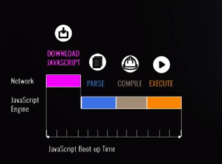

En lo que respecta a tree shaking podriamos traducirlo como "sacudir el arbol". Es una técnica en la cual removemos las librerías y código que no se utiliza en la app recordemos que apartir de angular 8 contamos con IVY un compilador mucho mas amable para que empaquetadores como webpack hagan eliminaciones de codigo dinamicas de parte que no estemos utilizando.

# Implementando Webpack Bundle Analyzer

El siguiente paso es ver el estado actual de nuestra aplicacion y hacer un dignostico y aqui es donde webpack bundle analyzer entra en juego.

webpack bundle analyzer nos devuelve un informe un reporte para mostrarnos que partes de nuestra app son las mas pesadas.

1- Instalamos la herrramienta

```
npm install webpack-bundle-analyzer --D

```

2- hacemos un build de produccion indicando q queremos esta estadistica.

```
ng build --prod --stats-json

```

3- En la carpeta publica del proyecto ubicamos el archivo dist/my-project/stats

4- Generamos nuestro reporte

```
npx webpack-bundle-analyzer dist/<tu-projecto-aqui></-project>/stats.json

```

# Alternativas source-map-explorer

<https://youtu.be/B-lipaiZII8?t=205>

1- Instalamos

```
npm i global source-map-explorer -D
```

2- Generamos el bundle para produccion.

```
ng build --prod
```

3- Y por último será simplemente ejecutar la herramienta, se selecciona el archivo que se quiere analizar:

```
source-map-explorer dist/pstore/main-es2015.d6173b504180f8c2ec5e.js

```

# Bundlephobia

<https://bundlephobia.com/>

Con bundlephobia.com podemos comparar librerias y utilizar las más convenientes para el peso de nuestro app con lo consiguiente reduciendo el tiempo de carga de la misma. Nos dice:

- El costo de los paquetes que utilizamos nos dice el peso y el peso minificado
- El tiempo de descarga
- Si es amigable con tree shaking.
- Ademas nos dice si hay paquetes similares y mas livianos

Ej date-fns es mejor que moment.

# Aplicando un Performance Budget desde el Angular CLI - Angular Budget

<https://perf-budget-calculator.firebaseapp.com/>

es una herramienta para colocar minimos de costo para nuestras aplicaciones.
angular.json permite configurar el peso maximo de nuestros paquetes

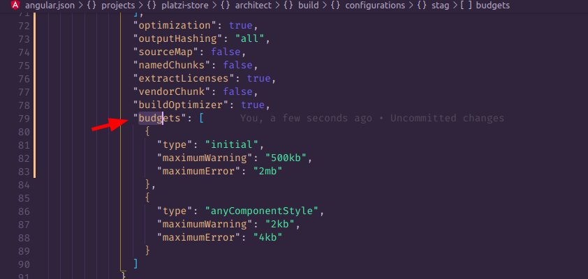
