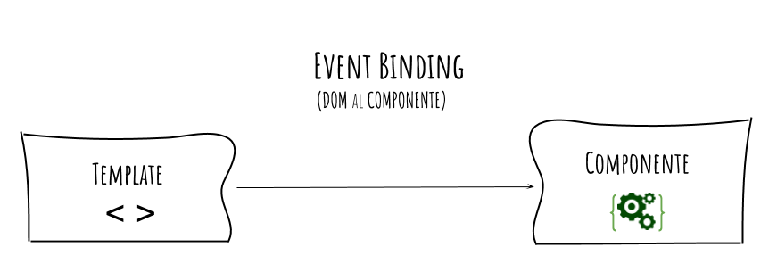
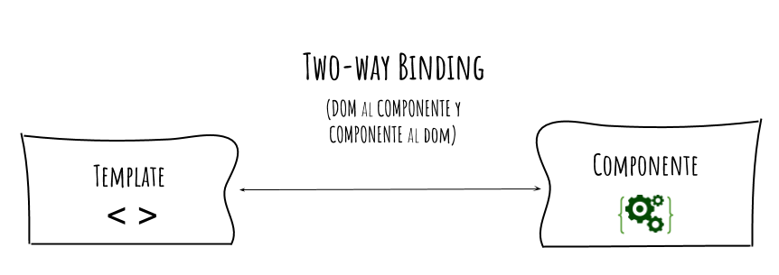

# Angular 101

Conceptos fundamentales de Angular 8. Bases sobre la arquitectura de este Framework para programar aplicaciones web con sus mejores prácticas. Conexion de aplicaciones con una API para obtener datos de un sistema de Backend. Distribución con Firebase

# ¿Que es ?

<https://ngchallenges.gitbook.io/project/angular>

Es un Framework o plataforma que te permite crear aplicaciones Web o SPA (Single Page Applications). Creado por Google.

# Angular CLI - Otros Comandos.

<https://cli.angular.io/>

- Dar de alta un proyecto

```
ng new project
```

- Proyecto modo desarrollo

```
ng serve --port 4200 --open
```

- compilar para produccion

```
ng build --prod
```

- Limpieza cache

```
npm cache clean -f
npm cache verify
```

- Que versiones tiene el proyecto

```
ng --version
```

- Generacion de componentes

```
ng generate component nombreComponente --module app.module
ng generate component nombre-del-component
ng g c nombre-del-component
```

- Generacion de interfaz

```
ng g i interfaz
```

- Generando PIPE

```
ng generate pipe new_pipe
```

- Generar directiva

```
ng generate directive <name>
ng g directive <name>
```

# Estructura

<https://angular.io/guide/file-structure>

├── .editorconfig # Configuración para editores de código
├── .gitignore # Lista de archivos no rastreados por git
├── angular.json # Archivo de configuraciones de construcción, compilacion y testing.
├── browserslist # Configuración compartidas para los navegadores
├── e2e/ # Carpeta para los test end to end
├── karma.conf.js # Configuraciones de Karma (Unit test)
├── node_modules/ # Carpeta de las librerías y paquetes instalados por npm
├── package-lock.json # Provee información sobre las versiones de las paquetes de npm
├── package.json # Configuración de las paquetes de npm
├── README.md # Introducción a la documentación de la app
├── src/ # Carpeta de la aplicación raíz (assets, componentes etc..)
├── tsconfig.app.json # Configuraciones de Typescript especificas de la app
├── tsconfig.json # Configuraciones de Typescript
├── tsconfig.spec.json # Configuraciones de Typescript para los test
└── tslint.json # Configuraciones TsLint

# Data binding en Angular

<https://angular.io/guide/binding-syntax>

FUENTE: <https://gustavodohara.com/blogangular/banana-in-box-banana-la-caja/>

¿Qué es «Banana In a Box»?, es una terminología de Angular que se refiere a ésta notación [()] que básicamente hace referencia a el famoso two-ways biding, o sea, al mecanismo de actualizar la vista y el modelo al mismo tiempo.

ngular está pensado para actualizar datos en la pantalla dinámicamente, me refiero a que en la pantalla en la que estamos, los datos van cambiando automáticamente sin referescar el browser. Por ejemplo, cuando apretás un botón, al ingresar tu email en un formulario, o si estás en una aplicación de chat, si la otra persona te escribe un mensaje, tu pantalla se actualiza con nuevos datos. Pero ésto no se hace mágicamente, los datos viajan del controlador a la vista (la pantalla que estás viendo) y también se puede dar el caso los datos viajan del controlador a la vista. Y por último, se puede dar el caso de que ambas acciones puedan pasar al mismo tiempo. Estos tres casos se pueden ver gráficamente de la siguiente forma y **para cada uno de esos casos, Angular tiene diferentes mecanismos para actualizar la pantalla**


## FROM Componente TO DOM - interpolation

_Forma de mostrar variables en tu template_

Los templates de Angular utilizan html como lenguaje de maquetación donde se puede ejecutar interpolación de strings mediante una implementación de moustache donde dentro de los corchetes puedes hacer una sentencia que se resolverá como un string para ser renderizado en el DOM.

Nuestros templates tienen acceso a las variables exportadas en el archivo .ts con el mismo nombre (componente), mismas que podemos renderizar mediante los string interpolation.

En el ejemplo vemos que hay una variable llamada «título» que tiene el valor «hola mundo», y ésta variable se quiere mostrar en la pantalla. Lo que Angular hace cuando encuentra los doble brackets ({{}}) es procesar el contenido de esa variable y devolverlo en forma de string.

Valido en los siguientes contextos

- {{ 1 + 1}}: la cual devuelve 2

- {{ miVariable }}: donde miVariable es una variable definida en el Component (como vimos en el ejemplo anterior)

- {{ miMetodo() }} : donde miMetodo() es un método definido en el Component

¡Ojo!

No sólo hace eso una vez, sino que, si en el medio cambiamos el valor de esa variable «título», el valor se va a actualizar en la pantalla sin que nosotros hagamos nada.


## FROM Component TO DOM ++

Al igual que la Interpolación, Property Binding se usa para pasar datos del Controler al DOM, y _los datos van en una única dirección_


Fijaté que la propiedad a modificar se encierra entre «[]», si no lo encerrás de esa forma esa propiedad no se va a modificar y sera como un simple string.

Esta forma puede aplicarse tanto a un elemento, como a un componente, como a una directiva, o sea, se le pueden pasar datos a cualquiera de esos tres:

- elemento: 

- componente: <vehicle-detail [vehicle]=”currenVehicle”></vehicle-detail>

- directiva: <div [ngClass] = “{selected: isSelected}”> X-Wig</div>

¡Ojo!

- No podés actualizar valores del elemento a la variable, solo podés setear propiedades de «afuera» para «adentro»
- No podés llamar a una función (para eso se usa event binding)
- No podés quedarte «escuchando» que una propiedad actualice tu variable o lo que le pases , no podés quedarte escuchando a que «algo» actualice miVariable y te avise. Sólo podés setearle el valor a la propiedad «src» (para eso se usa Banana in a Box)

# FROM DOM TO Componente.

Ésta es la forma de enviar «algo» del elemento al componente. Cualquier acción que haga el usuario (click, mouseover etc..) es una acción que se puede capturar. Cualquiera de esas acciones puede disparar una acción desde el elemento DOM hacia el Controlador. La forma de capturar cualquiera de esas acciones es quedarse escuchando un evento en particular y en el momento en que ocurran, ejecutar una acción.




- $event
  Cuando se declara un Event Binding, Angular le asigna al Evento a capturar un handler (o un manejador). Este manejador tiene como objetivo ejecutar la «template statement» cuando el evento ocurra. Además, lo que hace el handler es recibir un objeto llamado $event (este objeto es creado por Angular) y lo deja disponible para la Template statement por si necesita algún dato del evento.


Por ejemplo, en el Tag HTML «input» que captura datos del teclado del usuario, si uno quisiera capturar qué tecleó el usuario, se podría acceder de la siguiente forma: $event.target.value. El $event cambiará dependiendo del evento que se capture.

## Banana Box

Es la forma de two-way bidning o su forma común «banana in a box«, es la combinación de Property binding con Event binding, o sea, mezclamos [] con () y tenemos [()].

¿Para qué se usa el two-way bindings?, para enviar datos del DOM al Componente y del Componente al DOM, por eso se llama two-way binding



Si el usuario teclea algo, el Controlador será notificado y podrá efectuar una acción con eso. Y por otro lado, si el Controlador modifica la variable nombre (por ejemplo borrando los datos) el DOM se actualizará automáticamente. ¡Y nosotros no vamos a hacer nada!


Ojo!

para que funcione la directiva NgModule hay que importar el módulo FormsModule.

Conclusiones: Restringir el acceso del DOM al Controlador y viceversa, hace nuestro código mucho más legible, más controlado y menos propenso a errores. Cuando decidas si usar () ó [], o ambos, antes tomáte dos segundos para pensar que querés hacer: pasar datos del DOM al Controlador, del Controlador al DOM o ambos. Si tenés eso en mente, ¡tu código será mucho mejor!

# Directivas

<https://angular.io/api/common#directives>
<https://vanessamarely.medium.com/directivas-en-angular-efb8a8cf78e0>
Las Directivas extienden la funcionalidad del HTML usando para ello una nueva sintaxis. Con ella podemos usar lógica que será ejecutada en el DOM (Document Object Model).

Cada Directiva que usamos tiene un nombre, y determina donde puede ser usada, sea en un elemento, atributo, componente o clase.

Se dividen en tres tipos diferentes:

- Directivas de Atributo: (Alteran la apariencia o comportamiento de un elemento del DOM y son usados como atributos de los elementos.)
- Directivas de estructurales: (Alteran la estructura del DOM, agregando, eliminando y manipulando los elementos host a los que están unidos.
  )
- Componentes: (Las Directivas de Componente son directivas con un Template.)

# Uso de ngIf

<https://angular.io/api/common/NgIf>
Directiva de angular para realizar condicionales dentro de un template.

```
<div *ngIf="name === 'Christian' && lastname === 'Sanchez'">
      <p>Mi nombre es: {{name}} {{lastname}} </p>
</div>

```

```
<div *ngIf="condition">Content to render when condition is true.</div>

<div *ngIf="condition; else elseBlock">Content to render when condition is true.</div>
<ng-template #elseBlock>Content to render when condition is false.</ng-template>
```

```

<ng-template [ngIf]="isLoggedIn" [ngIfElse]="loggedOut">
    <div>
      Welcome back, friend.
    </div>
</ng-template>

<ng-template #loggedOut>
    <div>
      Please friend, login.
    </div>
</ng-template>

```

# Uso de ngFor add y delete

Para iterar amigo/a!

```javascript
array = ['🍎', '🍏', '🍇', '🍌', '🍑'];
  addItem() {
    this.array.push(this.title)
  }
  deleteItem(index:number) {
    this.array.splice(index,1)
  }
```

```javascript

<button (click)="addItem()">Add item</button>
<ul>
  <li *ngIf="array.length===0">La lista está vacía</li>
  <li *ngFor="let item of array;index as i">
    {{item}} ({{i}})
    <button (click)="deleteItem(i)">Delete</button>
  </li>
</ul>
```

# Uso de ngSwitch

<https://stackblitz.com/>

```javascript
<div [ngSwitch]="product.price">
    <p *ngSwitchCase="200.0">$20.00 de descuento en tu siguiente compra</p>
    <p *ngSwitchCase="500.0">Envío gratuito a toda la República Mexicana</p>
    <p *ngSwitchCase="80000.0">
      Envío gratuito a toda la República Mexicana + 5% de descuento extra
    </p>
    <p *ngSwitchDefault>Comprame!</p>
  </div>
```

# ¿Qué son los componentes y decoradores?

Los componentes son el bloque de construcción de UI más básico de una aplicación Angular. Una aplicación Angular contiene un árbol de componentes .

Gracias al parámetro @ podemos reconocer fácilmente que estamos hablando de un
decorador.
Generalmente usamos los decoradores para extender servicios de terceros, de esta manera evitamos modificar el código original del módulo y en tiempo de ejecución agregamos el funcionamiento que necesitamos. Abierto para extension cerrado para modificacion.

# Uso de Inputs y Outputs

- Input

Para comunicar de un componente padre a un componente hijo usamos Input y para Para pasar argumentos, desde el template padre podemos utilizar los corchetes cuadrados con el Input para pasar el argumento

- Output

Para comunicar de un componente hijo a un componente padre usamos Output.

Los Output son eventos que podemos cachar desde nuestro componente hijo por parte del padre.
Para declararlos en nuestro componente tenemos que usar el decorador @Output sobre un EventEmitter
Los EventEmmiter's pueden emitir un evento con un argumento que será recibido por el padre.

- Observables
  Por otro lado para comunicar dos componentes hermanos o componentes que no estan relacionados podemos usar observables

# Ciclo de vida de los componentes


- constructor:

Utilizado para crear nuestro componente y ponerlo en interfaz

- ngOnChanges

Detecta el cambio cada vez que tenemos un input. Cada vez que cambiamos la data podamos detectar esos cambios y ver el estado anterior y el estado nuevo.

- ngOnInit

Se ejecuta una vez y es cuando el componente ya está listo en interfaz gráfica, aquí es buena idea hacer llamadas a componentes como a una REST API.

- ngDoCheck

Detecta cuando los elementos hijos de ese componente también son creados y puestos en interfaz, contiene sub-métodos.

- ngAfterContentInit: Se ejecuta cuando Angular realiza cualquier muestra de contenido dentro de las vistas de componentes y justo después de ngDoCheck. Actuando una vez que todas las vinculaciones del componente deban
  verificarse por primera vez. Está vinculado con las inicializaciones del componente hijo.
- ngAfterContentChecked: Se ejecuta cada vez que el contenido del componente ha sido verificado
  por el mecanismo de detección de cambios de Angular; se llama después
  del método ngAfterContentInit. Este también se invoca en cada ejecución posterior de ngDoCheck y está relacionado principalmente con las inicializaciones del componente hijo.
- ngAfterViewInit: Se ejecuta cuando la vista del componente se ha inicializado por completo. Este método se inicializa después de que Angular ha inicializado la
  vista del componente y las vistas secundarias. Se llama después de ngAfterContentChecked. Solo se aplica a los componentes.

- ngAfterViewChecked: Se ejecuta después del método ngAfterViewInit y cada vez que la vista del componente verifique cambios. También se
  ejecuta cuando se ha modificado cualquier enlace de las directivas
  secundarias. Por lo tanto, es muy útil cuando el componente espera algún valor que proviene de sus componentes secundarios.

- ngOnDestroy

Detecta cuando el elemento es quitado desde la interfaz. Util para limpiar procesos de memoria.

# Uso de ng generate y ng lint

- <https://angular.io/cli/generate#ng-generate>

- ng lint
  Es una herramienta que ayuda a mejorar la escritura de código con buenas prácticas.

# Usando los pipes de Angular

<https://angular.io/guide/pipes>
Los pipes en Angular son transformaciones que se le puede hacer a un dato dentro de una template-expression sirve para formatear data como se desee. Los pipes pueden ser anidados, por lo que puede ser bastante poderoso.

```javascript
// La sintaxis es {{ variableName | pipeName:argumentos }}

{{ birthday | date:"MM/dd/yy" }}

{{ birthday | date | uppercase}}

```

- [AsyncPipe](https://angular.io/api/common/AsyncPipe)
- [CurrencyPipe](https://angular.io/api/common/CurrencyPipe)
- [DatePipe](https://angular.io/api/common/DatePipe)
- [DecimalPipe](https://angular.io/api/common/DecimalPipe)
- [I18nPluralPipe](https://angular.io/api/common/I18nPluralPipe)
- [I18nSelectPipe](https://angular.io/api/common/I18nSelectPipe)
- [JsonPipe](https://angular.io/api/common/JsonPipe)
- [KeyValuePipe](https://angular.io/api/common/KeyValuePipe)
- [LowerCasePipe](https://angular.io/api/common/LowerCasePipe)
- [PercentPipe](https://angular.io/api/common/PercentPipe)
- [SlicePipe](https://angular.io/api/common/SlicePipe)
- [TitleCasePipe](https://angular.io/api/common/TitleCasePipe)
- [UpperCasePipe](https://angular.io/api/common/UpperCasePipe)

# Construyendo un propio pipe

Generar

```
ng generate pipe pipes/exponential/exponential
ng g p pipes/exponential/exponential --module app

```

# Construyendo una directiva propia

Las directivas estan para tranformar los elementos del DOM dinamicamente.

Es muy sencillo manipular directamente elementos del DOM en Angular, solo hay que echar mano de la clase ElementRef Pero ojo! Angular lo etiqueta como una mala práctica. La manipulación directa del DOM crea un acoplamiento indeseado entre la capa de renderizado y la de lógica, Para sortear este obstáculo tienes la clase Renderer2 de Angular.
<http://blog.enriqueoriol.com/2017/08/angular-dom-renderer.html>

# Introducción al NgModule

Buena practica: Modular la aplicación por dominio

Los módulos y rutas sirven para dividir y abstraer mejor la aplicación.

Los componentes que hacen parte de una página en particular se pueden encapsular en un mismo módulo.

Los módulos especiales son core y shared.

- app/core: guarda todos los servicios y componentes que usaremos a lo largo de todos los otros módulos.Ej servicios de authenticacion unico para toda la aplicacion.

- app/shared: podemos almacenar componentes y servicios compartidos.

# Creando rutas en Angular

Las rutas nos sirven para mostrar en diferentes seccioens de nuestra pagina algun contenido.
En el archivo app-routing-module.ts se encuentra un objeto Route el cual sirve para incrustar las rutas del proyecto.

La sintaxis dentro del router (app-routing-module.ts):

```

import { componentName } from './url/to/componentName.component';

const routes: Routes = [
  {
    path = ‘routeName’,
    component = componentName
  },
]
```

Donde:

path = ruta relativa al home (’/’) de nuestra app
component = componente importado desde componentName.component.ts
La forma de implementar el router en un template.html es con el componente router-outlet, donde el router-outlet se reemplazará por el contenido del componente según la URL en la que estés

```
<!-- app.component.html -->

<router-outlet></router-outlet>
```

## 404

Para definir una página no encontrada podemos utilizar la ruta '\*\*' que simboliza cualquier ruta diferente a las anteriormente definidas, el componente también deberá de ser el objeto del componente importado.

```
{
    path: '**',
    component: NotFoundComponent
  }
```

Nota: El orden de las rutas es importante, si algo matchea una ruta, no se segirá a la siguiente, por lo que el not-found, debería de ser la última ruta, siempre

## Redirecciones

Para las redirecciones tenemos que usar las propiedades redirectTo:'route' y pathMatch:'full'

```
 {
    path: 'from',
    redirectTo: 'to',
    pathMatch: 'full'
  },
```

Donde:

- path: Página actual
- redirectTo: página a la que se redireccionará
- pathMatch: tipo de match, en el caso de ‘full’ será con una relación exacta
